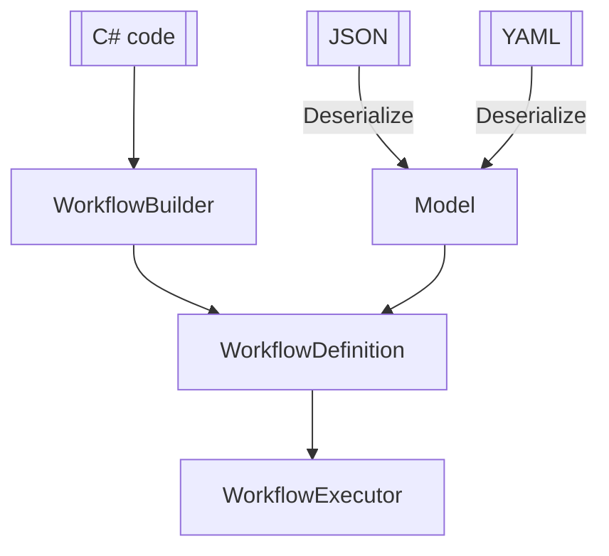
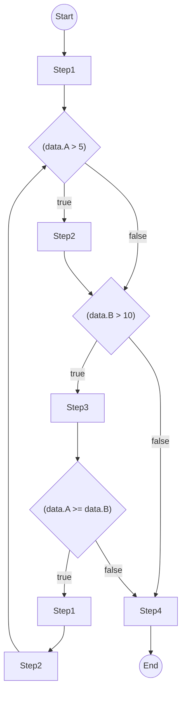

# StepFlow Core
Workflow engine library

## Architecture


## Mermaid flowchart generation
```csharp
.Step<Step1>()
.If("label1", data => data.A > 5, _ => _
    .Step<Step2>())
.If(data => data.B > 10, _ => _
    .Step<Step3>()
    .If(data => data.A >= data.B, __ => __
        .Step<Step1>()
        .Step<Step2>()
        .GoTo("label1")))
.Step<Step4>();
```


