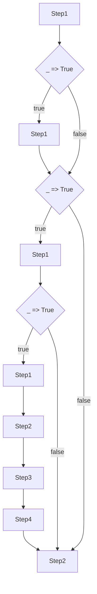

```mermaid
flowchart TB
node1[Step1]
node2{_ => True}
node3[Step1]
node4{_ => True}
node5[Step1]
node6{_ => True}
node7[Step1]
node8[Step2]
node9[Step3]
node10[Step4]
node11[Step2]

node1 --> node2
node2 -->|true| node3
node3 --> node4
node2 -->|false| node4
node4 -->|true| node5
node5 --> node6
node6 -->|true| node7
node7 --> node8
node8 --> node9
node9 --> node10
node10 --> node11
node4 -->|false| node11
node6 -->|false| node11
```
