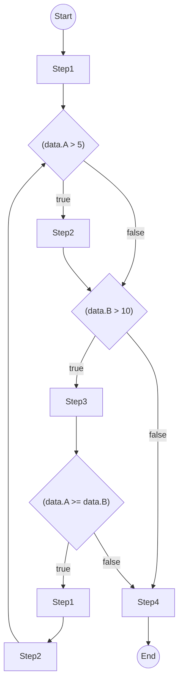

```mermaid
flowchart TB
startNode((Start))
node1[Step1]
label1{"(data.A > 5)"}
node2[Step2]
node3{"(data.B > 10)"}
node4[Step3]
node5{"(data.A >= data.B)"}
node6[Step1]
node7[Step2]
node9[Step4]
endNode((End))

startNode --> node1
node1 --> label1
label1 -->|true| node2
label1 -->|false| node3
node2 --> node3
node3 -->|true| node4
node3 -->|false| node9
node4 --> node5
node5 -->|true| node6
node5 -->|false| node9
node6 --> node7
node7 --> label1
node9 --> endNode
```
